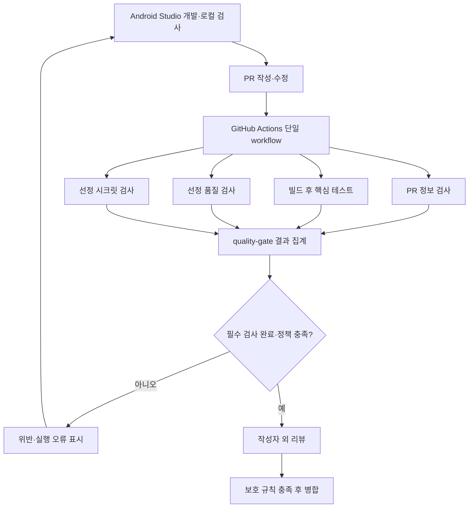

# PRD — AI 생성 코드 PR 자동 검증 및 승인 프로세스 구축

| 항목 | 내용 |
|---|---|
| 제품명 | AI-PR Gate |
| 버전·작성일 | v2.0 · 2026-09-20 |
| 팀 | 데굴데굴 · 박재영, 최현식, 이종서, 최미령, 장진웅 |
| 개발 환경 | Android Studio에서 Kotlin 앱 개발, GitHub Actions에서 PR 검사 |
| 기준 문서 | `../AI-PR_Gate_피드백반영_문제점과_수정계획.md` |
| 상세 명세 | `02_요구사항명세서_AI-PR-Gate.md` v2.0 |
| 상태 | 개발 착수를 위한 개정 기준안. 구현·실험 완료 또는 자문 승인 사실을 뜻하지 않음 |

## 1. 개정 목적

이 프로젝트는 **AI를 활용해 작성한 안드로이드 코드에 대해, 선정 근거가 있는 검사 정책을 PR 병합 조건으로 연결하고 실제 작동 여부를 검증하는 구축 과제**다. 새 분석 엔진이나 AI 생성 여부 판별기를 개발하지 않는다.

이전 기획은 도구·수치·검증 개수가 근거보다 먼저 확정되었다. 이번에는 다음과 같이 수정한다.

| 이전 | v2.0 기준안 |
|---|---|
| Room·Retrofit 동시 필수 | 로컬 할 일 앱·Room 필수, 네트워크 후속 |
| 여러 분석 도구·AI 리뷰 봇 동시 구현 | 빌드·핵심 테스트·검증된 품질/시크릿 정책·단일 게이트 우선 |
| 커버리지 60%, 함수 60줄, 복잡도 15 차단 | 동작 테스트 우선, 수치 선정 근거 없이는 차단하지 않음 |
| 위험 PR 10개 + 정상 PR 5개 | 정책별 입력·게이트 상태에서 사례 도출. PR 수는 별도 산출 |
| 실행 시간 10분 보장 | 최초·캐시 실행을 측정하고 허용 대기 시간은 파일럿 후 결정 |
| 설명용 코드를 실제 AI 위험 사례로 소개 | 전체 생성 시도·원본·사람 수정·검사 결과 연결 |
| 6단계 도식 중심 | 실제 실행 의존 관계·결과 계약·오류 처리·승인 조건 중심 |

**채택**은 이번 개발의 설계 선택, **파일럿 후 확정**은 실행 증거가 필요한 선택, **후속**은 이번 필수 인수 조건 밖을 뜻한다. 기획 결정과 검증 결과를 구분한다.

## 2. 문제 정의와 직접 기여

AI 사용 여부와 관계없이 변경 코드에는 요구사항 누락, 실행 오류, 비밀정보 노출, 부적절한 권한과 테스트 부족이 생길 수 있다. 현재 자료만으로 AI가 이러한 문제를 얼마나 자주 만드는지는 판단할 수 없다.

이번에 해결할 문제는 다음과 같다.

- 어떤 검사 기준으로 병합을 허용하는지와 그 이유가 기록되어 있지 않다.
- 도구 실패·결과 누락·오래된 결과가 병합 판단에 잘못 반영될 수 있다.
- AI 입력·실제 출력·사람 수정·최종 검사 결과가 연결되어 있지 않다.
- 자동 확인 범위와 사람의 검토 책임이 구분되지 않는다.

팀의 직접 기여는 **정책 선정, 결과 집계와 오류 처리, 병합 제한 연결, 증거 관리**다. 기존 도구의 탐지 기능 자체를 새로운 기술로 주장하지 않는다.

## 3. 사용자와 사용 흐름

| 사용자 | 필요한 결과 |
|---|---|
| PR 작성자 | 실패 원인·문제 위치·수정 및 재검사 방법 |
| 리뷰어 | 요구사항·테스트 근거·AI 활용 내역·자동 검사 한계 |
| 저장소 관리자 | 필수 정책·승인 조건·예외와 변경 이력 |
| 자문자·평가자 | 주장과 코드·PR·실행 로그 사이의 추적 가능성 |

`Android Studio 개발 → 로컬 검사 → PR 작성 → 자동 검사·집계 → 실패 수정 및 재검사 → 작성자 외 리뷰 → 보호 규칙에 따른 병합`을 기본 흐름으로 한다. 출처와 관계없이 같은 검사 정책을 적용하며 AI 활용 변경에는 생성 기록을 연결한다.

## 4. 목표와 완료 판단

| 목표 ID | 목표 | 완료 증거 |
|---|---|---|
| G-01 | 실행 가능한 기준 앱과 테스트 환경 | 새 checkout 빌드·테스트, 에뮬레이터 동작, Room 통합 확인 |
| G-02 | 선정 근거가 있는 자동 검사 정책 | 위험·정책 선정표, 정확한 룰·버전, 위험·정상 fixture 결과 |
| G-03 | 검사 결과와 사람 승인을 병합 조건으로 연결 | 정상·위반·검사 오류·승인 대기·새 커밋의 실제 기록 |
| G-04 | AI 생성과 변형을 추적 | 전체 시도 목록, 프롬프트·응답 원본, 수정 diff, SHA·로그·캡처 |
| G-05 | 팀원의 재실행을 지원 | README, 환경표, 정책표, 검증 추적표, 다른 팀원의 실행 기록 |

완료는 SRS 필수 요구사항과 인수 기준 충족으로 판단한다. 발견한 실패는 수정·재검증하거나, 범위 변경 이유와 관련 요구사항을 함께 개정한다. 실패 결과를 삭제하지 않는다.

실제 AI 관찰에서 위험 출력이 나오지 않아도 정상 결과와 한계를 보고하고 별도 표시한 수작업 fixture로 게이트를 검증할 수 있다. AI 위험 발생률, 모델 우열, 일반 탐지 정확도, 리뷰 시간 단축률은 이번 목표가 아니다.

## 5. 포함·조건부·제외 범위

### 5.1 필수 구현

- Kotlin·Jetpack Compose·ViewModel·Room 기반 로컬 할 일 앱.
- 목록, 제목 입력과 추가, 완료 변경, 삭제, 재실행 후 보존, 오류 안내.
- JVM 핵심 로직 테스트와 별도의 실제 Room 통합 검증.
- PR 템플릿, 최신 코드 검사, 빌드·테스트, 선정된 검사 룰, 결과 집계.
- 최신 필수 체크 통과와 작성자 외 승인 없이는 병합되지 않는 저장소 설정.
- AI 생성 기록, 위험·정책 선정표, 검증 결과, 로컬 실행 가이드.

### 5.2 파일럿 후 구체화

| 항목 | 초기 선택 | 확정 조건 |
|---|---|---|
| 품질 검사 | Android Lint 후보 | 앱 적용 룰의 실제 출력·정상 반례 확인, 룰별 BLOCK/WARN/REPORT 매핑 |
| 시크릿 검사 | gitleaks 후보 | 비활성 fixture 검출·정상 반례·출력 마스킹 확인 |
| 필수 자동 정책 | 빌드·테스트 외 품질 및 시크릿 범주 | 두 범주 각각 실제 BLOCK 룰과 정상 반례를 검증·활성화. 도구 이름만 지정하면 미완료 |
| 커버리지 | 핵심 로직 라인 커버리지 측정·보고 | 호환 도구·분모 확정. 초기 차단 하한 없음 |
| 실행 시간 | 실제 시간 수집 | runner·캐시 조건과 팀 허용 대기 시간을 반영해 목표 결정 |

품질·시크릿 범주를 필수로 둔 이유는 기능 테스트만으로 원래 과제의 품질·보안 정책 연결을 검증할 수 없기 때문이다. 범주 수는 성능 표본 수가 아니며, 정확한 룰 수는 파일럿에서 도출한다. 적절한 룰을 확보하지 못하면 도구를 계속 추가하지 말고 목표·범위·인수 조건을 재검토한다.

### 5.3 후속 또는 제외

로그인·서버·Retrofit·외부 API 키·동기화·앱 배포·AI 리뷰 봇·웹 대시보드·중복 스타일 도구·광범위 커스텀 분석·의존성 취약점 자동 차단·모델 비교는 후속 범위다. TLS·인증 위험은 현재 앱의 자동 차단 성과로 주장하지 않는다.

MVP는 신뢰된 팀원의 동일 저장소 브랜치 PR을 지원한다. 외부 fork PR 자동 실행 및 악의적인 팀원의 workflow·리포트 조작까지 자동 방어하는 시스템은 이번 범위가 아니다. 이 경계 안에서도 최소 권한과 정책 변경 리뷰는 필수다.

## 6. Android Studio 개발 대상

### 6.1 기준 앱: 로컬 할 일 관리

화면 개수를 목표로 삼지 않는다. 목록 화면에 추가 입력·빈 목록·오류 상태를 제공하고 완료 토글과 삭제를 지원한다. 편집·검색·정렬 옵션은 필수가 아니다.

| 동작 | 기대 결과 | 검증 |
|---|---|---|
| 목록 | 저장된 제목·완료 상태 표시, 항목이 없으면 빈 상태 | 조회·빈 상태 테스트 |
| 추가 | 양끝 공백 제거 후 비어 있지 않은 제목만 저장 | 정상·공백 입력 테스트 |
| 완료 변경 | 선택한 항목의 상태만 변경 | 대상 구분·토글 테스트 |
| 삭제 | 선택한 항목만 삭제 | 다른 항목 보존 테스트 |
| 재실행 | 성공적으로 저장한 데이터 유지 | 실제 Room·에뮬레이터 확인 |
| 저장 실패 | 성공으로 표시하지 않고 오류와 재시도 경로 제공 | fake 실패 테스트·UI 확인 |

데이터는 `id`, `title`, `isCompleted`로 최소화한다. 실사용 개인정보·인증정보 없이 테스트 데이터를 사용하고 네트워크·민감 권한을 요청하지 않는다. DB·백업·노출 컴포넌트 설정은 수동 검토한다.

### 6.2 개발 구조와 환경

`Compose UI → ViewModel → TaskRepository 인터페이스 → Room 구현·DAO`로 구성한다. fake repository로 핵심 로직의 정상·실패 상태를 검사한다. 실제 DB 저장은 Room 통합 검증으로 확인하고 fake 테스트를 DB 검증으로 표시하지 않는다.

Android Studio는 편집·Gradle 동기화·실행·디버깅 도구다. CI는 IDE UI 대신 저장소의 Gradle Wrapper와 기록된 SDK/JDK 조합을 사용한다. 로컬·CI가 동일한 빌드 정의를 사용한다. [Android 빌드 구성](https://developer.android.com/build)

정확한 Android Studio·AGP·Gradle·JDK·Kotlin·SDK 버전은 설치 환경에서 호환성을 확인한 후 환경표에 고정한다. 확인하지 않은 최신 버전을 가정하지 않는다.

## 7. 위험 후보와 선정 기준

| 영역 | 이번 처리 | 한계·선정 이유 |
|---|---|---|
| 요구사항 누락·잘못된 상태 변경 | 동작 테스트 + 사람 리뷰 | 빌드 성공만으로 정답을 보장하지 않음 |
| API·패키지 환각 | 빌드 + 의존성 출처 검토 | 빌드 가능한 잘못된 사용은 별도 검토 |
| 비밀정보 포함 | 선정 시크릿 룰 + 리뷰 | 패턴 밖 문자열은 미탐 가능 |
| 예외·취소·재시도·중복 처리 | 실패 테스트 + 리뷰, 룰은 파일럿 | 모든 catch를 취약으로 취급하지 않음 |
| 데이터 손실·저장·백업 | Room 통합 확인 + 설정 리뷰 | 전체 암호화·백업 보안 평가 아님 |
| 권한·exported·Intent 입력 | 기능과 Manifest 대조 | 속성을 문맥 없이 일괄 차단하지 않음 |
| 개인정보·로그 노출 | 데이터·로그 리뷰 | 실사용 민감 데이터 취급 제외 |
| 메인 스레드·코루틴·생명주기 | 코드 리뷰 + 실행 확인 | 코루틴 존재만으로 안전 판정 불가 |
| 복잡도·스타일·중복 | 리뷰, 추가 분석 도구 후속 | 60줄·15를 필수 차단값으로 사용하지 않음 |
| 테스트 assertion·누락 경로 | 테스트 리뷰 + 실패 fixture | 테스트 파일 변경 여부만으로 충분성 판단 불가 |
| 의존성 출처·라이선스·취약점 | 버전·출처 목록, 수동 검토 | 자동 취약점 차단 미구현 |
| TLS·인증·암호·서버 인가 | 비적용 사유 기록 | 현재 기능 없음. 기능 추가 시 재검토 |
| AI 출처·환각·설명 책임 | 전체 생성 기록·원문 대조·리뷰 | 작성자의 실제 이해를 자동 보장하지 않음 |
| CI 권한·결과 누락·오래된 결과 | 결과 계약·실패 처리·보호 규칙 | 신뢰된 팀 개발이라는 운영 경계 유지 |

위험 선정표에는 `위험 ID / 앱 적용성 / 영향 / 관찰·참고 근거 / 탐지 수단·한계 / 정상 반례 / 비용 / 자동·수동·후속·비적용 / 담당·검토일`을 기록한다. 도구 개수나 점수 합계만으로 선정하지 않는다.

정책 결정표에는 `정책 ID / 대상 파일·variant / 도구·버전·룰 ID / 원본 등급 / BLOCK·WARN·REPORT / 근거 / 파일럿 결과 / 예외·기한 / 결정자·검토일`을 기록한다. 도구 기본값이 곧 프로젝트 차단값은 아니다.

## 8. 시스템 구조와 병합 원칙

이 도식은 채택한 실행 설계이며 구현 완료도는 아니다. 검사 job은 독립적으로 시작하고 앱 job 내부에서 빌드 후 테스트한다. 빌드 실패로 다른 독립 검사를 생략하지 않는다. 집계는 선행 실패에도 실행을 시도한다. 전체 취소로 집계가 완료되지 않으면 성공으로 대체하지 않는다.

필수 결과 정상 완료 및 BLOCK 없음일 때만 `quality-gate`를 성공 처리한다. 누락·파싱 오류·취소·timeout은 코드 위반과 구분해 통과를 막는다. 사람 승인 대기는 자동 검사 실패와 다르다.

결과는 PR·head SHA·실제 검사 SHA·실행 ID로 연결한다. 최신 기준 브랜치와의 관계, 새 커밋 후 승인 무효화, 직접 push 제한을 실제 저장소에서 확인한다. skipped 결과가 병합을 막는다고 가정하지 않는다. [필수 상태 검사 주의사항](https://docs.github.com/en/pull-requests/how-tos/merge-and-close-pull-requests/troubleshooting-required-status-checks)

PR 코드 실행 경로에 외부 API 키·배포 키를 전달하지 않는다. 최소 권한을 사용하며 PR 텍스트를 shell 명령에 직접 삽입하지 않는다. [GitHub Actions 보안 지침](https://docs.github.com/en/actions/reference/security/secure-use)

## 9. AI 생성 증거 수집

개발자가 실제 사용 가능한 코드 생성 도구를 선택한다. Android Studio 사용이 특정 AI 제품 사용을 뜻하지 않는다. 첫 생성 전에 도구·표시 모델·접근 방식·기록 방법을 정한다.

1. 기준 커밋과 일반 기능 요청을 먼저 기록한다.
2. 입력 파일·전체 프롬프트·응답·표시 모델·시각을 보존한다.
3. 정상·문제·컴파일 실패·거절을 포함한 모든 시도를 목록에 남긴다.
4. 원본 출력과 사람 수정 후 앱 통합 코드를 구분하고 diff를 보존한다.
5. 문제 판정 근거를 작성하고 다른 팀원이 검토한다.
6. 원문·캡처·파일·SHA·검사 실행을 연결한다.

일반 요청 관찰, 오류 수정 후속 요청, 의도적 위험 생성, 수작업 주입을 구분한다. 위험이 나올 때까지 반복하고 성공 화면만 발표하지 않는다. 시작 전에 관찰 시간과 종료 조건을 기록하며 생성 횟수와 위험 사례 수를 구분한다. 모델 세부 버전·설정이 공개되지 않았다면 확인 불가로 적는다.

## 10. 검증 설계와 지표

| 계층 | 대상 | 수행 방법 |
|---|---|---|
| 앱 | 정상·빈 상태·입력 검증·실패·저장 보존 | JVM 테스트, Room 통합, 에뮬레이터 |
| 룰 | 위험·유사 정상·해당 경계·변형 | 로컬 fixture·실제 출력 |
| 집계 | 성공·위반·경고·누락·오류·실행 식별 | 결과 fixture 기반 테스트 |
| PR 연결 | 정상→승인, 위반→수정, 본문 수정, 새 커밋, 직접 push 제한 | 실제 PR·보호 규칙 |
| AI 관찰 | 입력 조건·출처·판정 | 전체 시도·원본 증거 대조 |

요구사항과 정책에서 사례를 도출하고 `fixture 수`, `상태 사례 수`, `PR 수`, `CI 실행 수`, `AI 생성 시도 수`를 따로 집계한다. 룰 변형은 로컬 검사로 확인하고 PR에는 대표 연결 사례를 배치한다. 목록을 실행 전에 고정하고 변경 이유를 남긴다.

정책 판정 일치 건수/전체 사례, 목표 위험 검출 건수/위험 사례, 정상 오탐 건수/정상 사례, 실행 장애 건수·원인을 보고한다. 무관한 빌드 실패는 목표 룰의 검출 성공이 아니다. 분모 0은 해당 없음이다. 작은 선정 표본의 결과를 일반 정확도로 확대하지 않는다.

대기열, runner 시작부터 게이트 완료까지, 사람 승인 대기를 구분해 시간을 기록한다. 최초·캐시 실행과 환경을 구분한다. 커버리지는 분모·제외 이유·라인 측정법을 공개하고 초기에는 보고만 한다.

## 11. 단계·역할·일정

기존 문서의 사업 종료 예정일은 2026-10-30이다. 실제 제출 일정과 가용 시간은 착수 시 확인한다. 아래는 완료를 보장하는 주차별 일정이 아니라 의존성과 종료 조건이다.

| 단계 | 작업 | 종료 조건 |
|---|---|---|
| A 환경·범위 | 앱·계정·권한·도구 조합·담당·가용 시간 | 환경표, 보호 기능 사용 가능 확인 |
| B 기준 앱 | 최소 기능·핵심 테스트·Room 통합 | 로컬에서 재실행 가능한 기준 커밋 |
| C 첫 연결 | PR→빌드·테스트→게이트→승인 | 정상·실패 경로의 실제 로그 |
| D 근거 확보 | AI 관찰·위험 분류·품질/시크릿 파일럿 | 정책·반례·한계 확정 |
| E 정책 강화 | 선정 룰·본문 검사·오류 상태·보호 규칙 | 필수 검증 사례를 실행 가능한 구현 |
| F 검증·정리 | 실행·수정·재검증·구현도·운영 문서 | SRS 인수 기준 및 미검증 한계 보고 |

AI 기록은 첫 개발부터 병행한다. 역할은 앱·테스트, CI·게이트, 검사 정책, 생성 증거·검증, 문서·통합으로 나눈다. 이전 담당 배정을 확정 사실로 재사용하지 않고 A단계에서 담당자·예상 시간·검토자를 기입한다.

시간 부족 시 UI 장식·추가 검사·자동 코멘트 등 후속 기능부터 제외한다. 증거 기록과 실패 상태 검증을 생략해 기능 수를 유지하지 않는다.

## 12. 산출물과 미확정 사항

필수 산출물: 앱 저장소, 환경표, PR workflow·집계 코드, 위험 선정표, 정책 결정표, AI 생성 기록, 검증 추적표·실제 결과, 보호 설정 증거, README와 실제 구현도. 원본 증거는 실키·개인정보 없이 공유한다.

| 결정 항목 | 상태 | 확정 담당·시점 |
|---|---|---|
| 로컬 할 일·Room, 네트워크 제외 | 이번 기준안 채택 | 앱 담당, A단계 적합성 확인 |
| 단일 workflow·단일 필수 게이트 | 이번 기준안 채택 | CI 담당, C단계 실행 확인 |
| IDE·AGP·Gradle·JDK·Kotlin·SDK 버전 | 미확정 | 앱·CI 담당, B단계 전 |
| 품질·시크릿 룰·예외 | 파일럿 필요 | 검사 담당·검토자, E단계 활성화 전 |
| 커버리지 도구·시간 목표 | 파일럿 필요 | 테스트·CI 담당, F단계 보고 전 |
| AI 도구·모델·종료 기준 | 미확정 | 생성 담당, 첫 생성 전 |
| 저장소 플랜·보호 권한·일정·담당 | 미확정 | 팀장, A단계 |

기능을 추가·제외하면 관련 위험·정책·FR·검증·일정도 함께 개정한다. 기존 발표 프롬프트와 PPT의 ‘15개·60%·10분·AI 봇 필수’는 v2.0 개발 기준이 아니다.

기술 근거는 링크한 공식 문서를 2026-09-20에 확인했다. 문서 작성만으로 실제 생성 결과·탐지 성능·실행 시간이 검증된 것은 아니다.
